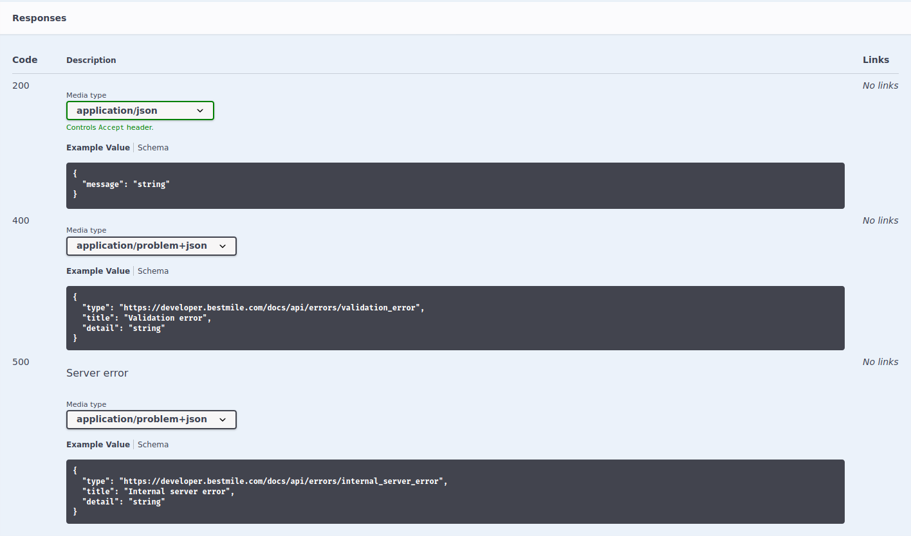

# Endpoints with Problem Details Errors

Represent both technical and business errors with [Problem Details] entities.

## Run

~~~
$ sbt
> run
~~~

Then try the following requests:

- http://0.0.0.0:8000/greet?name=Alice
- http://0.0.0.0:8000/greet?name=Voldemort
- http://0.0.0.0:8000/dummy
- http://0.0.0.0:8000/documentation.json
- http://0.0.0.0:8000/assets/swagger-ui/index.html

[Problem Details]: https://tools.ietf.org/html/rfc7807
